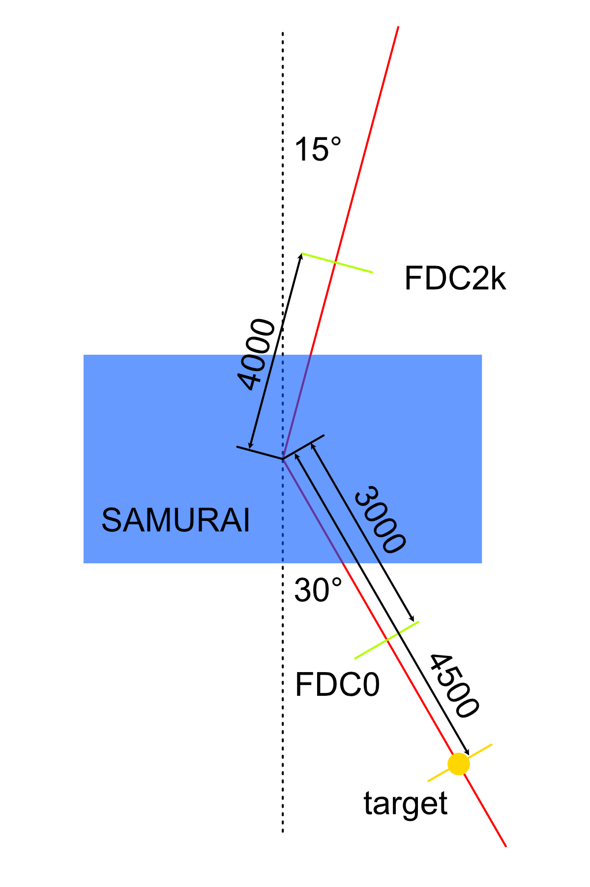

# SAMUrig
A fourth-order Runge-Kutta simulation program to find rigidity of particles passing through SAMURAI magnet

modify the main.go file to change the distances and angles in your setup. The default values are shown in the figure:

modify rig/work.go if your input file has a different format.